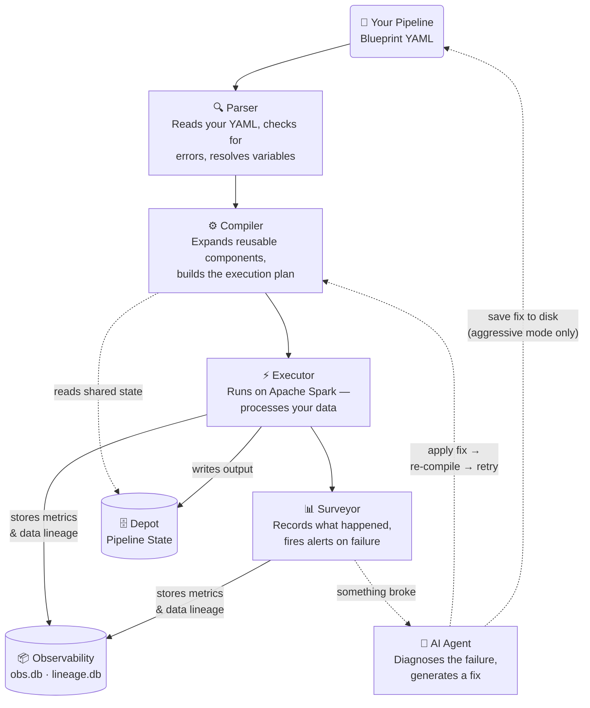

# Aqueduct

**Intelligent, self-healing Spark pipelines. Declarative. Observable. Autonomous.**

[](LICENSE)
[](https://www.python.org/)

Aqueduct is a control plane for Apache Spark. You write pipelines as YAML *Blueprints*. Aqueduct validates, compiles, and executes them while monitoring every step. When something breaks, Aqueduct can **autonomously patch the pipeline** using an LLM agent, applying structured, auditable fixes.

> ### ⚠ The LLM can edit your Blueprints
>
> Self-healing is opt-in. The agent only modifies your Blueprint file when `agent.approval_mode` is set to `auto` or `aggressive`. **The default is `disabled`** — no LLM call, no Blueprint mutation, no Spark hidden cost.
>
> For production, prefer:
> - `human` — patch is staged to `patches/pending/` for an engineer to apply via `aqueduct patch apply`.
> - `ci` — patch is `POST`ed to a configured webhook (`agent.ci_webhook_url`) so your CI system can open a PR.
>
> `aggressive` mode additionally requires `danger.allow_aggressive_patching: true` in `aqueduct.yml`. Patches always pass through deterministic guardrails (`agent.guardrails.allowed_paths`, `forbidden_ops`, `heal_on_errors`, `never_heal_errors`) — the LLM cannot bypass them by hallucination, because enforcement happens at patch-apply time in code, not at prompt time.

---

## Documentation

| Document | Description |
|---|---|
| [Blueprint & Engine Spec](docs/specs.md) | Full specification — module types, config fields, compiler, executor, LLM agent, patch grammar |
| [Spark Guide](docs/SPARK_GUIDE.md) | Compiler warnings, probe cost model, contributor rules, resource tuning, S3A committers, AQE |
| [CLI Reference](docs/CLI_REFERENCE.md) | All commands, flags, exit codes, `aqueduct run` / `patch` / `doctor` / `heal` reference |
| [All Tables Reference](docs/ALL_TABLES.md) | Schema + example queries for every DuckDB table Aqueduct writes (obs.db, lineage.db, depot.db) |

---

## What Makes Aqueduct Different?

- **Declarative YAML Blueprints** - No DAG wiring in code. Version-control your entire pipeline.
- **Any Spark Connector** - Pass any format Spark supports (JDBC, Kafka, Avro, ORC, Delta, Parquet, CSV…) directly in config. Aqueduct adds no format restrictions.
- **Self-Contained Failure Context** - Every failure ships a complete `FailureContext` JSON: failed module config, upstream lineage, Probe signals, retry history, and provenance metadata (where each value came from in the Blueprint). The LLM, or you, can diagnose without touching logs.
- **Patch Grammar, Not Codegen** - The LLM operates inside a structured `PatchSpec` schema. Patches are auditable, reversible, and never hallucinate invalid YAML.
- **Zero-Cost Observability** - Probes capture schema snapshots, null rates, value distributions, distinct counts, freshness, and sample rows using lazy Spark operations and sampling. Costly sample-scan signals are gated behind `danger.allow_full_probe_actions` (default `false`) so production runs are zero-extra-action by default.
- **Inline Data Quality Gates** - `Assert` modules enforce schema, row counts, null rates, freshness, and custom SQL rules inline. Failing rows route to a spillway; the pipeline aborts, warns, fires a webhook, or triggers the LLM agent based on per-rule configuration.
- **Spillway Error Routing** - Bad rows route to a separate error Egress with `_aq_error_*` metadata columns. Good rows flow uninterrupted.
- **Depot KV Store** - Cross-run pipeline state backed by DuckDB. Read at compile time via `@aq.depot.get()`, write at runtime via `format: depot` Egress. Powers `materialize: incremental` on Channels - watermark-based incremental reads without a streaming engine.
- **Passive-by-Default Gates** - Regulators (signal-driven quality gates) compile away entirely unless wired to a Probe signal. Zero overhead for unused features.

---

## How It Works



---

## Installation

```bash
# Core CLI + parser + compiler + LLM self-healing (no Spark dependency)
pip install aqueduct-core

# With Spark execution (required for aqueduct run)
pip install aqueduct-core[spark]

# With secrets provider backends
pip install aqueduct-core[aws]      # AWS Secrets Manager (boto3)
pip install aqueduct-core[gcp]      # GCP Secret Manager
pip install aqueduct-core[azure]    # Azure Key Vault
pip install aqueduct-core[secrets]  # All three secrets backends at once

# Everything (Spark + every secrets backend)
pip install aqueduct-core[all]
```

The base package installs the CLI, parser, compiler, and LLM self-healing. All LLM providers (Anthropic, OpenAI-compatible, Ollama) use `httpx` which is a core dependency - no extra install needed. Spark execution requires the `[spark]` extra (`pyspark`, `delta-spark`).

Requires Python 3.11+ and Java 17 (for local Spark). **Spark 3.3+ recommended** for full metrics collection (`records_written`, `records_read`). Older versions collect `bytes` and `duration_ms` only; row counts will be 0.

---

## Quick Start

```bash
mkdir my-pipeline && cd my-pipeline

# 1. Creates: blueprints/example.yml, aqueduct.yml, .gitignore, patches/, arcades/
# 2. Runs git init + initial commit automatically
aqueduct init --name my-pipeline
```

Or manually:

### 1. Write a Blueprint

```yaml
# pipeline.yml
aqueduct: "1.0"
id: my.first.pipeline
name: "Order Processing"

context:
  today: "@aq.date.today()"   # resolved at compile time; reference as ${ctx.today} in config values

modules:
  - id: raw_orders
    type: Ingress
    label: "Load orders"
    config:
      format: parquet
      path: "s3a://data/orders/"

  - id: clean_orders
    type: Channel
    label: "Filter invalid rows"
    config:
      op: sql
      query: |
        SELECT *
        FROM raw_orders
        WHERE amount IS NOT NULL
          AND order_date <= CURRENT_TIMESTAMP()
      spillway_condition: "amount IS NULL OR order_date > CURRENT_TIMESTAMP()"

  - id: good_output
    type: Egress
    label: "Write clean orders"
    config:
      format: parquet
      path: "s3a://processed/orders/date=${ctx.today}/"
      mode: overwrite

  - id: error_output
    type: Egress
    label: "Write rejected rows"
    config:
      format: parquet
      path: "s3a://errors/orders/date=${ctx.today}/"
      mode: overwrite

edges:
  - from: raw_orders
    to: clean_orders
  - from: clean_orders
    to: good_output
  - from: clean_orders
    to: error_output
    port: spillway
```

### 2. Configure the engine

```yaml
# aqueduct.yml
aqueduct_config: "1.0"

deployment:
  master_url: "spark://your-cluster:7077"

spark_config:
  spark.hadoop.fs.s3a.endpoint: "http://minio:9000"
  spark.hadoop.fs.s3a.access.key: "@aq.secret('S3_KEY')"
  spark.hadoop.fs.s3a.secret.key: "@aq.secret('S3_SECRET')"
  spark.jars.packages: "org.apache.hadoop:hadoop-aws:3.3.4"

stores:
  obs:
    path: ".aqueduct/obs.db"
  lineage:
    path: ".aqueduct/lineage.db"
  depot:
    path: ".aqueduct/depot.db"
```

### 3. Run

Aqueduct auto-loads a `.env` file from the project root before executing - put secrets there and reference them as `@aq.secret('MY_KEY')` in your Blueprint. No credential hardcoding required.

```bash
aqueduct run pipeline.yml --config aqueduct.yml
```

```
▶ my.first.pipeline  (4 modules)  run=abc123  master=spark://your-cluster:7077
  ✓ raw_orders
  ✓ clean_orders
  ✓ good_output
  ✓ error_output

✓ pipeline complete  run_id=abc123
```

---

## Secrets Management

`@aq.secret('KEY')` resolves a secret at compile time. By default (`provider: env`) it reads `os.environ`. For cloud deployments, configure a backend provider in `aqueduct.yml`:

```yaml
secrets:
  provider: aws        # env | aws | gcp | azure | custom
  region: us-east-1   # AWS only; GCP/Azure use env-var-based config
```

| Provider | Backend | Install |
|---|---|---|
| `env` (default) | `os.environ` / `.env` file | built-in |
| `aws` | AWS Secrets Manager via `boto3` | `pip install aqueduct-core[aws]` |
| `gcp` | GCP Secret Manager via `google-cloud-secret-manager` | `pip install aqueduct-core[gcp]` |
| `azure` | Azure Key Vault via `azure-keyvault-secrets` | `pip install aqueduct-core[azure]` |
| `custom` | Any callable `(key: str) -> str \| None` | built-in |

All backends cache the resolved value into `os.environ` after the first fetch — subsequent calls within the same run are free.

**Custom provider** — point to any Python callable:

```yaml
secrets:
  provider: custom
  resolver: my_org.vault.fetch_secret  # importlib path; fn(key: str) -> str | None
```

**Note:** `aqueduct.yml` itself is loaded before the secrets provider is live, so secrets in `aqueduct.yml` always use `${VAR}` env-var syntax. Use `@aq.secret()` in Blueprint files.

`aqueduct doctor` validates provider-specific SDK availability and configuration before any run.

---

## LLM Provider Options

`provider_options` passes extra parameters to the configured LLM provider. Keys prefixed with `ollama_` route to Ollama's `options` payload; unprefixed keys merge to the top-level request body:

```yaml
agent:
  provider: openai_compat
  base_url: "http://localhost:11434/v1"
  model: "llama3.1:70b"
  provider_options:
    ollama_num_thread: 8    # → payload["options"]["num_thread"]
    ollama_num_gpu: 1       # → payload["options"]["num_gpu"]
    temperature: 0.1        # → payload["temperature"]
```

---

## Core Concepts

### Blueprint

A YAML file describing your pipeline. Contains modules (data sources, transforms, sinks) and edges (data flow).

### Manifest

The compiled, fully-resolved form of a Blueprint. All `@aq.*` runtime tokens resolved, Arcades expanded, passive Regulators compiled away. This is what the Executor runs.

### Module Types

| Type | Role |
|---|---|
| `Ingress` | Load data from any Spark-supported source |
| `Egress` | Write data to any Spark-supported sink, or `format: depot` for KV state; `collect: true` to pull results to driver; `register_as_table` to catalog the output |
| `Channel` | Transformation (SQL or 12 native ops: deduplicate, filter, select, rename, cast, join, union, sort, repartition, coalesce, cache + sql); optional `spillway_condition` routes bad rows |
| `Junction` | Split one DataFrame into named branches (conditional / broadcast / partition) |
| `Funnel` | Merge multiple DataFrames (union_all / union / coalesce / zip) |
| `Probe` | Capture observability signals (schema, null rates, value distribution, distinct counts, freshness, partition stats, sample rows) - never halts pipeline |
| `Regulator` | Data quality gate; evaluates Probe signals; blocks or skips downstream on failure |
| `Assert` | Inline data quality rules (schema, row counts, null rates, freshness, SQL, custom); failing rows route to spillway |
| `Arcade` | Reusable sub-Blueprint; namespaced and inlined at compile time |

### Runtime Functions (`@aq.*`)

Resolved at compile time on the driver:

```yaml
path: "s3a://data/date=@aq.date.today()/"
path: "s3a://data/from=@aq.depot.get('last_run_date', '2020-01-01')/"
run_id: "@aq.runtime.run_id()"
prev_run: "@aq.runtime.prev_run_id()"
key: "@aq.secret('MY_SECRET')"
```

### Channel `op: join`

Higher-level join syntax - no raw SQL needed for common join patterns:

```yaml
- id: enrich_orders
  type: Channel
  config:
    op: join
    left: orders_ingress       # upstream module ID (registered as temp view)
    right: customers_ingress   # upstream module ID
    join_type: left            # inner | left | right | full | semi | anti | cross
    condition: "orders_ingress.customer_id = customers_ingress.id"
    broadcast_side: right      # optional: BROADCAST hint for smaller side
```

For complex multi-table joins or window functions, use `op: sql` directly.

### SQL Macros

Define reusable SQL fragments at compile time - resolved before Spark runs, no runtime overhead:

```yaml
macros:
  active: "status = 'active' AND deleted_at IS NULL"
  trunc:  "DATE_TRUNC('{{ period }}', {{ col }})"

modules:
  - id: clean
    type: Channel
    config:
      op: sql
      query: |
        SELECT * FROM src
        WHERE {{ macros.active }}
          AND {{ macros.trunc(period='day', col=event_ts) }} >= '2026-01-01'
```

Macros are static - no loops, no conditionals. The Manifest always contains plain SQL.

### Spillway

Route bad rows to a separate sink without stopping the pipeline:

```yaml
- id: clean
  type: Channel
  config:
    op: sql
    query: "SELECT * FROM __input__"
    spillway_condition: "amount IS NULL"  # rows matching this → spillway port

edges:
  - from: clean
    to: good_sink           # clean rows
  - from: clean
    to: error_sink
    port: spillway          # null-amount rows with _aq_error_* columns
```

### Incremental Channel (`materialize: incremental`)

Process only new data each run - no streaming engine required. Aqueduct stores the high-water mark in Depot and injects it into your SQL at runtime:

```yaml
- id: new_orders
  type: Channel
  config:
    op: sql
    materialize: incremental
    watermark_column: event_ts        # column whose MAX tracks progress
    query: |
      SELECT *
      FROM source_orders
      WHERE event_ts > CAST('${ctx._watermark}' AS TIMESTAMP)

- id: append_sink
  type: Egress
  config:
    format: parquet
    path: "s3a://datalake/orders/incremental/"
    mode: append   # use append, not overwrite
```

First run: `${ctx._watermark}` = `'1900-01-01 00:00:00'` → full scan. Each subsequent run: resolves to `MAX(event_ts)` from the previous run's output, automatically stored in Depot. Watermark is only advanced on success - a failed run re-processes the same window.

> **Note:** `${ctx._watermark}` is a runtime substitution, not a Tier 0 context ref - it is not listed in the `context:` block and is not visible in the compiled Manifest's `context` field.

### Assert - Inline Data Quality Gates

Enforce explicit business rules against the flowing DataFrame. Unlike Probe + Regulator (which evaluate signals from a prior run), Assert evaluates rules inline and can quarantine bad rows to a spillway:

```yaml
- id: orders_quality
  type: Assert
  label: "Quality gate"
  config:
    rules:
      - type: schema_match
        expected: {order_id: long, amount: double}
        on_fail: abort
        error_type: SchemaError        # typed label for guardrail matching

      - type: min_rows
        min: 1000
        on_fail: abort
        error_type: EmptyDataset

      - type: null_rate
        column: order_id
        fraction: 0.1      # sample 10% for speed
        max: 0.001
        on_fail: abort

      - type: freshness
        column: event_time
        max_age_hours: 4
        on_fail: warn

      - type: sql
        expr: "SUM(amount) > 0"
        on_fail:
          action: webhook
          url: "${ALERT_WEBHOOK}"

      - type: sql_row
        expr: "amount > 0 AND order_id IS NOT NULL"
        on_fail: quarantine    # bad rows → spillway port

edges:
  - from: clean_orders
    to: orders_quality
  - from: orders_quality
    to: good_egress
  - from: orders_quality
    port: spillway
    to: quarantine_egress
```

**Performance:** All aggregate rules (`min_rows`, `freshness`, `sql`) batch into one `df.agg()`. All `null_rate` rules share one `df.sample().agg()`. Schema match is zero-action. Row-level rules (`sql_row`, `custom`) are lazy filters. **At most 2 Spark actions** per Assert module.

**`error_type` field:** Each rule accepts an optional `error_type:` string. When the rule fires, the label propagates through `ModuleResult` → `FailureContext` and is available to the LLM guardrail system (see below).

**vs Spillway:** Spillway catches UDF runtime exceptions (bad rows discovered during execution). Assert enforces explicit business rules you declare up front. They solve different problems and compose naturally.

### Depot KV Store

Persist state across pipeline runs:

```yaml
# Read at compile time
path: "s3a://data/from=@aq.depot.get('last_processed_date', '2020-01-01')/"

# Write at runtime (Egress module)
- id: save_watermark
  type: Egress
  config:
    format: depot
    key: last_processed_date
    value_expr: "MAX(order_date)"   # single Spark aggregate
```

### `aqueduct test` - Isolated Module Testing

Test Channel, Junction, Funnel, and Assert modules against inline data - no real sources, no external I/O:

```yaml
# pipeline.aqtest.yml
aqueduct_test: "1.0"
blueprint: pipeline.yml

tests:
  - id: test_filter_nulls
    description: "Null amounts must be removed"
    module: clean_orders

    inputs:
      raw_orders:
        schema:
          order_id: long
          amount: double
        rows:
          - [1, 10.0]
          - [2, null]

    assertions:
      - type: row_count
        expected: 1
      - type: contains
        rows:
          - {order_id: 1, amount: 10.0}
      - type: sql
        expr: "SELECT count(*) = 1 FROM __output__"
```

```bash
aqueduct test pipeline.aqtest.yml
aqueduct test pipeline.aqtest.yml --blueprint pipeline.yml --quiet
```

**Assertion types:** `row_count` (exact count), `contains` (rows must appear in output), `sql` (SQL expression over `__output__` view returns truthy).

### Agent Guardrails

Two tiers of guardrails, both deterministic — not prompt hints:

**Post-generation guards** (enforced at patch-apply time — reject bad patches):

```yaml
agent:
  approval_mode: auto
  guardrails:
    forbidden_ops:
      - remove_module        # LLM can never delete modules autonomously
      - replace_retry_policy # retry config managed by humans only
    allowed_paths:
      - "s3://company-data/*"   # fnmatch - LLM may only write paths matching these patterns
      - "data/raw/*"
```

- `forbidden_ops` — PatchSpec operation names always blocked. Empty = all ops permitted.
- `allowed_paths` — fnmatch patterns restricting `path`/`output_path` config values. Empty = unrestricted.

**Pre-trigger guards** (block or whitelist LLM before it even fires):

```yaml
agent:
  guardrails:
    # Whitelist: LLM only fires when the failure matches one of these labels.
    # Labels come from Assert rules' error_type field, or from the exception
    # class name in the stack trace (e.g. "SparkException", "AnalysisException").
    heal_on_errors:
      - DataQualityViolation
      - SchemaError

    # Blacklist: LLM never fires on these. Takes priority over heal_on_errors.
    never_heal_errors:
      - SLABreach            # ops team handles SLA violations manually
      - EmptyDataset         # upstream data missing — LLM can't fix that
```

- `heal_on_errors` — if non-empty, LLM only triggers when the failure's `error_type` (or stack trace exception class) matches. Empty = no restriction.
- `never_heal_errors` — LLM never fires when failure matches. Takes priority over `heal_on_errors`.

`aqueduct doctor` warns if a guardrail entry doesn't match any `error_type` declared in the blueprint's Assert rules (catches typos before they silently have no effect).

If a patch violates `forbidden_ops` or `allowed_paths`, `apply_patch` raises an error before touching the Blueprint file.


---

## Observability

Aqueduct writes all observability data to DuckDB files under `.aqueduct/`:

```
.aqueduct/
  obs.db          - run records, probe signals, module metrics, signal overrides
  lineage.db      - column-level lineage
  depot.db        - depot KV store (@aq.depot.*)
  snapshots/      - schema_snapshot JSON files (one per probe per run)
```

```bash
# Run records and probe signals (all in obs.db)
duckdb .aqueduct/obs.db
SELECT run_id, blueprint_id, status, started_at, finished_at FROM run_records;
SELECT probe_id, signal_type, payload FROM probe_signals ORDER BY captured_at DESC;

# Depot state
duckdb .aqueduct/depot.db
SELECT key, value, updated_at FROM depot_kv;

# Column lineage
duckdb .aqueduct/lineage.db
SELECT channel_id, output_column, source_table, source_column FROM column_lineage;
```

Or use the CLI:

```bash
aqueduct runs                        # list recent runs
aqueduct runs --failed --last 10     # last 10 failed runs
aqueduct report <run_id>             # detailed flow report
aqueduct lineage <blueprint_id>      # column lineage graph
```

---

## Scope — What Aqueduct Is and Is Not

| What it is | What it isn't (use these instead) |
|---|---|
| A **batch processing engine** for Apache Spark — each run is finite, starts, processes a bounded dataset, completes. | Streaming (Spark Structured Streaming / Kafka) — deferred to spec v1.1; use Spark Structured Streaming or Flink directly. |
| A **declarative control plane** — engineers describe *what*, not *how* Spark executes. | A visual graph editor / drag-and-drop UI — Blueprint YAML is the source of truth. A UI would be a separate product layer. |
| A **data preparation layer** producing validated DataFrames in storage. | An ML training orchestrator — use MLflow Pipelines, Vertex AI Pipelines, or Kubeflow. Aqueduct prepares the data they consume. |
| An **LLM-integrated operations tool** — self-healing, patch lifecycle, FailureContext, deterministic guardrails. | An LLM autonomous infrastructure agent — Aqueduct's LLM scope is bounded to PatchSpec operations on the Blueprint. It cannot run shell, modify infra, or call arbitrary APIs. |
| A **CLI invoked by an orchestrator** (cron, Airflow, Prefect, Dagster, K8s CronJob). | A scheduler — `aqueduct run` is a one-shot command, not a daemon. |
| A **Spark execution engine** (Flink is a stub for v1.1). | A multi-engine federated query layer — use Trino / Starburst / Athena for that. |

See [§13 of the spec](docs/specs.md) for the full scope statement and roadmap (Flink, MLOps inference op, MCP server, multi-pipeline orchestration).

---

## Development & Contributing

```bash
# Clone and install in editable mode with all dev dependencies
git clone https://github.com/sadigaxund/aqueduct
cd aqueduct
pip install -e ".[spark,dev]"

# Switch to Java 17 (required for local Spark) then run the test suite
source ~/.bashrc && use_java17
pytest tests/
```

- **Bug reports & feature requests** — open an issue. See [CONTRIBUTING.md](CONTRIBUTING.md) for guidelines.
- **Pull requests** — check [CONTRIBUTING.md](CONTRIBUTING.md) before submitting.
- **Changelog** — all releases and phase completions tracked in [CHANGELOG.md](CHANGELOG.md).

---

## Versioning & Stability

Aqueduct follows [semver](https://semver.org). The v1.0 stability contract:

**Stable** (semver applies):
- CLI command + flag names (see `aqueduct --help`)
- `--format json` output on `aqueduct runs`, `patch list`, `patch preview`
- Top-level imports: `parse`, `ParseError`, `AqueductWarning`, `__version__`, `exit_codes`
- Storage table schemas in [`docs/ALL_TABLES.md`](docs/ALL_TABLES.md)
- Blueprint schema via `aqueduct schema --target blueprint`
- Warning rule IDs (`AQ-WARN [rule_id] ...`)

**Exit codes** (`aqueduct/exit_codes.py`):

| Code | Constant | Meaning |
|---|---|---|
| 0 | `SUCCESS` | Command completed |
| 1 | `CONFIG_ERROR` | Malformed `aqueduct.yml` / Blueprint schema |
| 2 | `DATA_OR_RUNTIME` | Spark / Assert / network / runtime error |
| 3 | `HEAL_PENDING` | Patch staged for human review (`human` / `ci` mode) |
| 4 | `VALIDATION_GATE` | Patch rejected by Gate 1–4 |
| 5 | `USAGE_ERROR` | Invalid CLI flag / missing arg |

**Not stable**: subpackage internals (`aqueduct.compiler.*`, `aqueduct.executor.*`, etc.), human-readable log lines (use `--log-format json` for structured output), pre-v1.0 alpha / RC builds.

**Deprecation policy** (applies from v1.0.0): a deprecated name emits `DeprecationWarning` for one full minor release with the replacement listed, then is removed in the next minor.

---

## License & Philosophy

**Aqueduct is Apache 2.0 licensed.** See [LICENSE](LICENSE).

This repository contains the full, production-ready engine. No "pro" tier, no telemetry, no lock-in. Run it locally, in CI, or on a production cluster — free and open, forever.
