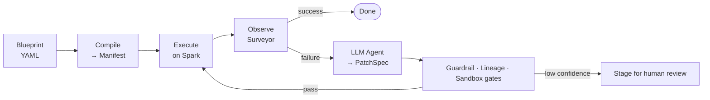
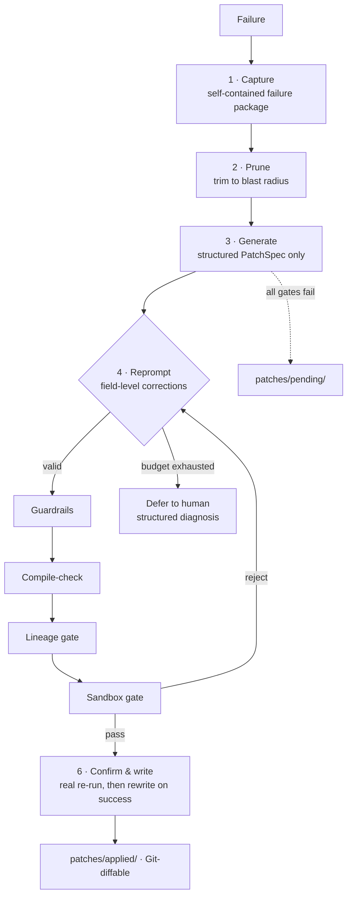
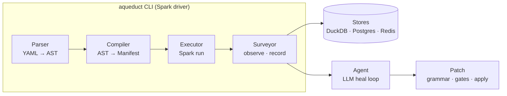

<p align="center">
  
</p>

<h1 align="center">Aqueduct</h1>

<p align="center">
  <strong>Self-healing Spark pipelines. Declarative. Observable. Autonomous.</strong>
</p>

<p align="center">
  <a href="https://pypi.org/project/aqueduct-core/"></a>
  <a href="https://www.python.org/"></a>
  <a href="https://github.com/sadigaxund/aqueduct/actions/workflows/test-suite.yml"></a>
  <a href="https://github.com/sadigaxund/aqueduct/actions/workflows/version-matrix.yml"></a>
  <a href="https://pepy.tech/project/aqueduct-core"></a>
  <!-- TODO(maturity): set the real project status. Options: experimental · alpha · beta · stable -->
  
  <a href="LICENSE"></a>
  <a href="https://github.com/sadigaxund/aqueduct/stargazers"></a>
</p>

---

## Why Aqueduct

A Spark job fails at 3 a.m. on a column rename upstream. Today that means a paged engineer scrolling a four-kilobyte JVM stack trace to find a one-line fix.

Aqueduct turns that into a Git-diffable patch waiting for you in the morning.

- **Declarative, not DAG code.** Pipelines are YAML *Blueprints* — no PySpark boilerplate, no scheduler glue, no operator classes.
- **Self-healing, not just alerting.** On failure an LLM agent diagnoses the root cause and emits a structured patch that passes guardrail, lineage, and sandbox gates *before* it touches your pipeline. No codegen, no shell access, no silent mutation.
- **Observable by construction.** Every run, every heal attempt, every column-lineage edge is recorded in a queryable store — at zero extra Spark actions on the hot path.

> **Wake up to a pending patch — not a wall of Spark errors.**

<!--
  ┌──────────────────────────────────────────────────────────────┐
  │  TODO(demo): drop a terminal GIF / asciinema cast here.       │
  │  Ideal clip: `aqueduct run` hits a schema-drift failure, the  │
  │  agent generates a patch, gates pass, the re-run goes green.  │
  │  ~20s. This is the single highest-impact addition to the README. │
  └──────────────────────────────────────────────────────────────┘
-->
<p align="center">
  <em>📽️ Demo coming soon — a live heal, start to green, in under 20 seconds.</em>
</p>

---

## Table of Contents

- [How It Works](#how-it-works)
- [Core Concepts](#core-concepts)
- [The Healing Flow](#the-healing-flow)
- [Architecture](#architecture)
- [Getting Started](#getting-started)
- [How It Compares](#how-it-compares)
- [References](#references)
- [Contributing](#contributing)

---

## How It Works

Aqueduct is a control plane for Apache Spark. You describe *what* the pipeline does; Aqueduct compiles, runs, observes, and — when it breaks — repairs it.



1. You write a **Blueprint** (YAML).
2. Aqueduct **compiles** it into a Manifest.
3. The **Executor** runs it on Spark.
4. The **Surveyor** observes everything.
5. On failure, the **LLM Agent** emits a structured `PatchSpec`.
6. The patch clears guardrail → lineage → sandbox gates, then re-runs — or stages for review.

**Model-agnostic by design.** The healing loop works with any LLM — a local 7B on Ollama up to a frontier model via API. The constrained PatchSpec grammar (13 deterministic operations, no code generation) means even small models produce valid, guardrail-passing patches for common failures: path typos, format mismatches, column renames, SQL fixes. <!-- TODO(claim): verify the 70% figure against a published `aqueduct benchmark` run and link the results here. --> Around **70% of production Spark errors are healable by a 7B model in a single attempt.** Advanced features like `deep_loop` (in-conversation sandbox feedback) and multi-model cascades push heal rates higher with larger models.

## Core Concepts

| Concept       | Purpose                                       |
|---------------|-----------------------------------------------|
| **Blueprint** | Your pipeline definition                      |
| **Ingress**   | Reads sources (CSV, Parquet, Delta, JDBC)     |
| **Channel**   | Transformations (SQL or native ops)           |
| **Egress**    | Writes sinks (overwrite, append, Delta merge) |
| **Junction**  | Fan-out (conditional, broadcast, partition)   |
| **Funnel**    | Fan-in (unions, coalesce, zip)                |
| **Spillway**  | Routes bad rows to error sink                 |
| **Probe**     | Non-blocking observability taps               |
| **Assert**    | Inline quality gates                          |
| **Depot**     | Cross-run state & watermarks                  |
| **Arcade**    | Reusable sub-pipelines                        |

Full details in the [References](#references).

## The Healing Flow

When a pipeline fails, Aqueduct does not throw a stack trace at an LLM and hope. Healing is a staged, auditable pipeline, and the model works inside a constrained grammar — it cannot write code, mutate files, or run shell commands.



### Approval modes

Who applies a generated patch. Deterministic guardrails — allowed paths, forbidden operations, minimum confidence — bound every patch regardless of mode.

| Mode | Who applies the patch | When the Blueprint changes | Use when |
|---|---|---|---|
| `disabled` | LLM never fires | Never | Healing is intentionally off. |
| `human` | Engineer reviews and applies | Only after human accepts | Production. Default behind CI/CD. |
| `ci` | External CI receives patch, opens a PR | Only after merge | Production with code review. |
| `auto` | Aqueduct applies in-memory, re-validates, writes only if the re-run succeeds | Only on a successful re-run | Trusted environments — dev, scoped pipelines. |

Low-confidence patches and any guardrail violation auto-escalate to human review.

<details>
<summary><strong>What a patch looks like</strong> (click to expand)</summary>

Every patch is a `PatchSpec` — a structured, Git-diffable JSON document staged under `patches/pending/`. No code, no shell, just declarative operations against the Blueprint:

```jsonc
// patches/pending/hello-pipeline-20260611T031412.json (abridged)
{
  "patch_id": "hello-pipeline-20260611T031412",
  "run_id": "9f3c2e1a",
  "category": "config_error",
  "root_cause": "Ingress 'load' reads data/in.csv, but the upstream job renamed the file to data/input.csv.",
  "confidence": 0.92,
  "rationale": "PATH_NOT_FOUND on data/in.csv; a sibling data/input.csv exists with a matching schema, so the path is stale rather than the data missing.",
  "operations": [
    { "op": "set_module_config_key", "module_id": "load", "key": "path", "value": "data/input.csv" }
  ]
}
```

Review it, then `aqueduct patch apply` — or let `auto` mode validate and apply it for you.

</details>

### Why it holds up

- **No silent mutations.** Every patch is a structured diff with a rationale and a confidence score; low confidence escalates.
- **No production data corruption.** The sandbox validates patches against representative data before any live write.
- **No runaway loops.** A multi-axis budget bounds wall-clock, tokens, reprompt count, and stuck-signature windows; a rolling rate-limit caps heals per hour per blueprint.
- **No black-box decisions.** Every LLM turn persists with the gate that rejected it, a stable error signature, and the prompt version. One run id joins every iteration of a heal.
- **Efficient.** Healing stops on the first successful patch. Structured error extraction replaces multi-kilobyte traces with a short root-cause block, and cheap lineage/sandbox checks reject bad patches in seconds before any full-pipeline replay.

For the stage-by-stage detail, see the [Blueprint & Engine Spec](docs/specs.md).

## Architecture

Aqueduct is a single CLI that runs on the Spark driver — no servers, no daemons. Logic flows through four immutable layers:



- **Parser** validates YAML into an immutable AST.
- **Compiler** resolves context, expands Arcades and macros, extracts column lineage, and assembles a fully-resolved Manifest.
- **Executor** runs the Manifest on Spark; all PySpark code is isolated under `executor/spark/`.
- **Surveyor** records runs, failures, and lineage to pluggable stores and triggers the Agent on failure.

## Getting Started

### Installation

```bash
pip install aqueduct-core[spark]
```

> **Requirements:** Python 3.11+ · Java 17 for the `spark` extra (`JAVA_HOME` must point to it).
> Every release is CI-tested against three pinned combos — **LTS** (Python 3.11 · Spark 4.1), **Latest** (Python 3.13 · Spark 4.1), **Legacy** (Python 3.12 · Spark 3.5). Live results in the [Compatibility Matrix](docs/compatibility.md).

Compose extras as needed — `pip install aqueduct-core[spark,airflow,aws]`:

| Extra | Adds | Install when |
|---|---|---|
| `spark` | PySpark 4 + Delta Lake | Running pipelines on this host. |
| `airflow` | Apache Airflow operator shim | Scheduler / worker host; the box submitting jobs to Spark. |
| `secrets` | AWS + GCP + Azure secret-manager SDKs (or pick `aws` / `gcp` / `azure` individually) | Resolving `@aq.secret('KEY')` against a cloud vault. |
| `stores` | Postgres + Redis backends (or pick `postgres` / `redis` individually) | Replacing single-writer DuckDB defaults for obs / lineage / depot. |
| `all` | Everything above | Single-laptop dev. |

### A first blueprint

```yaml
aqueduct: "1.0"
id: hello.pipeline

macros:
  active: "status = 'active' AND deleted_at IS NULL"

modules:
  - id: load
    type: Ingress
    config: { format: csv, path: "data/in.csv", options: { header: true } }

  - id: clean
    type: Channel
    config:
      op: sql
      query: "SELECT order_id, amount FROM load WHERE {{ macros.active }}"

  - id: save
    type: Egress
    config: { format: parquet, path: "data/out/", mode: overwrite }

edges:
  - { from: load,  to: clean }
  - { from: clean, to: save }

agent:
  approval_mode: human
  budget:
    max_reprompts: 5
    max_seconds: 120
    same_signature_overall: 3
```

Engine-wide defaults live in a separate `aqueduct.yml` (LLM provider, store backends, danger settings). Inline module tests live in `*.aqtest.yml`. Repeatable healing benchmarks live in `*.aqscenario.yml`. The [Gallery](gallery/) has runnable examples of each.

### Five commands to know

1. **`aqueduct doctor blueprints/hello.yml`** — preflight check. Validates YAML, resolves paths, verifies LLM reachability, opens stores.
2. **`aqueduct run blueprints/hello.yml`** — execute the pipeline. On failure, the agent generates a patch under `patches/pending/`.
3. **`aqueduct patch apply patches/pending/<id>.json --blueprint blueprints/hello.yml`** — review and accept a staged patch. Moves it to `patches/applied/`.
4. **`aqueduct test blueprints/hello.aqtest.yml`** — run Channel / Junction / Funnel modules against inline data. No Ingress, no Egress, no external I/O.
5. **`aqueduct benchmark gallery/aqscenarios/ --model claude-sonnet-4-6 --model qwen2.5-coder:7b`** — compare LLM models against simulated failures. No Spark required.

Full reference in [CLI Reference](docs/cli_reference.md).

## How It Compares

<!-- TODO(positioning): tighten these one-liners with real benchmark/feature claims once verified. -->

| | Aqueduct | dbt | Dagster / Airflow | Raw PySpark |
|---|---|---|---|---|
| Pipeline definition | Declarative YAML Blueprints | SQL models | Python DAG code | Imperative code |
| Engine | Apache Spark | Warehouse SQL | Orchestration only | Apache Spark |
| On failure | **Autonomous LLM patch + gates** | Manual fix | Retry / alert | Manual fix |
| Column lineage | Built-in, compile-time | Built-in | Plugin | DIY |
| Built-in observability store | Yes (DuckDB/Postgres) | Partial | External | DIY |

Aqueduct sits where a Spark transformation engine and an autonomous repair loop meet — it is not a scheduler (pair it with Airflow via the `airflow` extra) and not a warehouse SQL tool.

## References

- **[Blueprint & Engine Spec](docs/specs.md)** — Module types, configs, architecture, healing loop
- **[CLI Reference](docs/cli_reference.md)** — All commands and flags
- **[Spark Guide](docs/spark_guide.md)** — Warnings, performance, tuning
- **[Observability Guide](docs/observability_guide.md)** — Schemas + diagnostic query cookbook
- **[Production Guide](docs/production_guide.md)** — Cluster deployment, security, Delta operations
- **[Compatibility Matrix](docs/compatibility.md)** — Supported Python × Spark versions, pinning recipe
- **[Roadmap](docs/roadmap.md)** — Deferred features and future plans
- **[Gallery](gallery/)** — Real working examples

## Contributing

Contributions are welcome! See [CONTRIBUTING.md](CONTRIBUTING.md).

**Aqueduct is Apache 2.0 licensed** — free, open source, no telemetry, no lock-in.
