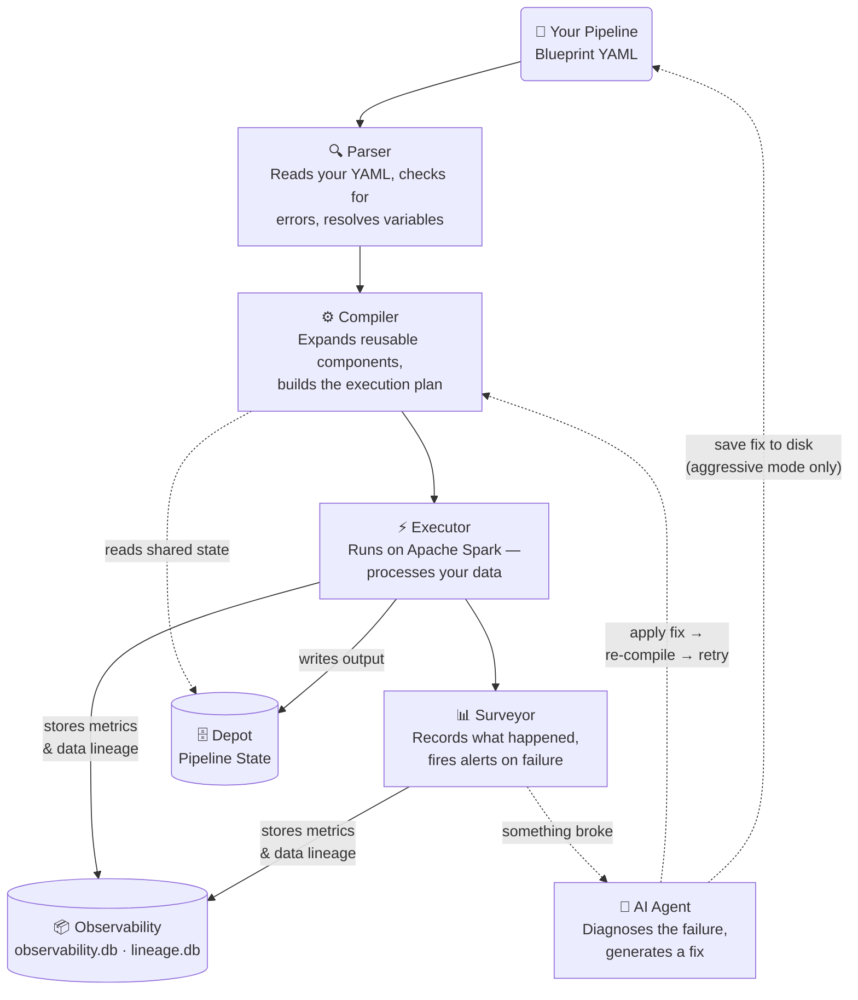

<p align="center">
  
</p>

<h1 align="center">Aqueduct</h1>

<p align="center">
  <strong>Agentic Spark — intelligent, self-healing pipelines. Declarative. Observable. Autonomous.</strong>
</p>

<p align="center">
  <em>Wake up to a pending patch awaiting your approval — not a wall of error logs.</em>
</p>

<p align="center">
  <a href="https://pypi.org/project/aqueduct-core/"></a>
  <a href="https://www.python.org/"></a>
  <a href="https://github.com/sadigaxund/aqueduct/actions/workflows/ci.yml"></a>
  <a href="LICENSE"></a>
</p>

---

Aqueduct is a control plane for Apache Spark. You write pipelines as YAML *Blueprints*. Aqueduct validates, compiles, and executes them while monitoring every step. When something breaks, Aqueduct can **autonomously patch the pipeline** using an LLM agent, applying structured, auditable fixes.

> 🛡️ **Self-healing is opt-in and off by default.** The agent never calls an LLM or touches your Blueprint unless you set `agent.approval_mode`. See [Agent Guardrails](#agent-guardrails) for the approval modes and the deterministic guards that bound what a patch can do.
---

## Contents

**Guides**

- [Blueprint & Engine Spec](docs/specs.md): every module type, config field, the compiler/executor/agent, patch grammar
- [CLI Reference](docs/CLI_REFERENCE.md): all commands, flags, exit codes
- [Spark Guide](docs/SPARK_GUIDE.md): compiler warnings, probe cost model, resource tuning, S3A committers, AQE
- [All Tables Reference](docs/ALL_TABLES.md): schema + example queries for every table Aqueduct writes
- [**Gallery**](gallery/): runnable examples. 20 feature snippets, a full Spark-cluster showcase, self-healing scenarios

**This page**

- [What Makes Aqueduct Different?](#what-makes-aqueduct-different) · [How It Works](#how-it-works) · [Glossary](#glossary)
- [Installation](#installation) · [Quick Start](#quick-start) · [Core Concepts](#core-concepts)
- [Configuration](#configuration) · [Observability & Self-Healing](#observability--self-healing)
- [Scope](#scope) · [Versioning & Stability](#versioning--stability) · [Development & Contributing](#development--contributing)

---

## What Makes Aqueduct Different?

- **Declarative YAML Blueprints** - No DAG wiring in code. Version-control your entire pipeline.
- **Any Spark Connector** - Pass any format Spark supports (JDBC, Kafka, Avro, ORC, Delta, Parquet, CSV…) directly in config. Aqueduct adds no format restrictions.
- **Self-Contained Failure Context** - Every failure ships a complete `FailureContext` JSON: failed module config, upstream lineage, Probe signals, retry history, and provenance metadata (where each value came from in the Blueprint). The agent, or you, can diagnose without touching logs.
- **Patch Grammar, Not Codegen** - The agent operates inside a structured `PatchSpec` schema. Patches are auditable, reversible, and never hallucinate invalid YAML.
- **Zero-Cost Observability** - Probes capture schema snapshots, null rates, value distributions, distinct counts, freshness, and sample rows using lazy Spark operations and sampling. Costly sample-scan signals are gated behind `danger.allow_full_probe_actions` (default `false`) so production runs are zero-extra-action by default.
- **Inline Data Quality Gates** - `Assert` modules enforce schema, row counts, null rates, freshness, and custom SQL rules inline. Failing rows route to a spillway; the pipeline aborts, warns, fires a webhook, or triggers the agent based on per-rule configuration.
- **Spillway Error Routing** - Bad rows route to a separate error Egress with `_aq_error_*` metadata columns. Good rows flow uninterrupted.
- **Depot KV Store** - Cross-run pipeline state backed by DuckDB. Read at compile time via `@aq.depot.get()`, write at runtime via `format: depot` Egress. Powers `materialize: incremental` on Channels - watermark-based incremental reads without a streaming engine.
- **Passive-by-Default Gates** - Regulators (signal-driven quality gates) compile away entirely unless wired to a Probe signal. Zero overhead for unused features.

---

## How It Works



Five layers, one direction: **Parser → Compiler → Executor → Surveyor**, with the **Agent** as an optional repair loop hanging off the Surveyor. The vocabulary below is themed after Roman aqueduct engineering — each term's *function* is stated first, the metaphor second.

---

## Glossary

### Engine vocabulary

| Term | What it does | Metaphor |
|---|---|---|
| **Aqueduct** | The engine: parses, compiles, runs, and self-heals Spark pipelines end to end. | A Roman aqueduct carries the flow the whole way. |
| **Blueprint** | Your pipeline as YAML — modules + edges. The human-authored source of truth. | The drawn plan before anything is built. |
| **Manifest** | The compiled, fully-resolved Blueprint the Executor runs: `@aq.*` tokens resolved, Arcades expanded, passive Regulators removed. | The finalized build spec handed to the crew. |
| **Parser** | Reads the Blueprint YAML, validates schema, resolves variables. | Industry-standard term (intentionally not themed). |
| **Compiler** | Expands Arcades/macros, builds the execution plan, emits the Manifest. | Industry-standard term. |
| **Executor** | Runs the Manifest on Apache Spark. | Industry-standard term. |
| **Surveyor** | Observability + self-healing orchestrator: records every run, persists signals & lineage, commissions the Agent on failure. | The Roman surveyor who set the aqueduct's gradient and inspected the structure. |
| **Agent** | The LLM repair brain: turns a `FailureContext` into a structured, guardrailed `PatchSpec`. Opt-in; default off. | Modern term — no metaphor. |
| **Depot** | Cross-run key/value state store; powers incremental watermarks (`@aq.depot.*`). | The cistern that holds water between flows. |
| **Spillway** | Error-row overflow: bad rows divert to a side sink with `_aq_error_*` columns; good rows flow on. | A dam's spillway sheds excess without breaking the structure. |
| **Probe** | Taps the flowing DataFrame for observability signals without halting it. | An inspection tap on the channel. |
| **Regulator** | Signal-driven quality gate; opens/closes downstream flow based on a Probe signal; compiles away if unwired. | The sluice that regulates flow. |
| **Arcade** | A reusable sub-Blueprint, namespaced and inlined at compile time. | The repeating arched span of a Roman aqueduct. |

### Module types

| Type | Role |
|---|---|
| `Ingress` | Load data from any Spark-supported source |
| `Egress` | Write data to any Spark-supported sink, or `format: depot` for KV state; `collect: true` to pull results to driver; `register_as_table` to catalog the output |
| `Channel` | Transformation (SQL or 12 native ops: deduplicate, filter, select, rename, cast, join, union, sort, repartition, coalesce, cache + sql); optional `spillway_condition` routes bad rows |
| `Junction` | Split one DataFrame into named branches (conditional / broadcast / partition) |
| `Funnel` | Merge multiple DataFrames (union_all / union / coalesce / zip) |
| `Probe` | Capture observability signals (schema, null rates, value distribution, distinct counts, freshness, partition stats, sample rows) - never halts pipeline |
| `Regulator` | Data quality gate; evaluates Probe signals; blocks or skips downstream on failure |
| `Assert` | Inline data quality rules (schema, row counts, null rates, freshness, SQL, custom); failing rows route to spillway |
| `Arcade` | Reusable sub-Blueprint; namespaced and inlined at compile time |

---

## Installation

Most people want the Spark build:

```bash
pip install aqueduct-core[spark]
```

That is everything needed to author and run pipelines. The bare core
(`pip install aqueduct-core`, no Spark) still does `validate`, `compile`,
and the self-healing agent (all providers use `httpx`, already included).

Optional extras, added only if you need them:

- `[spark]`: Spark execution (`pyspark`, `delta-spark`). Required for `aqueduct run`.
- `[aws]` / `[gcp]` / `[azure]`: one cloud secrets backend.
- `[secrets]`: all three secrets backends.
- `[airflow]`: Airflow operator + deferrable sensor (`aqueduct.integrations.airflow`).
- `[schedulers]`: aggregate of all scheduler integrations (currently just `airflow`).
- `[all]`: Spark plus secrets, store backends, and scheduler integrations.

Needs Python 3.11+. Local Spark needs Java 17. Spark 3.3+ gives full
row-count metrics; older Spark reports only `bytes` and `duration_ms`.

---

## Quick Start

Scaffold a project:

```bash
pip install aqueduct-core[spark]
aqueduct init my-pipeline
cd my-pipeline
```

`aqueduct init` lays out the project structure (`blueprints/ aqtests/
aqscenarios/ arcades/ patches/`), writes `.template` files for the config,
Blueprint, test, and scenario formats, drops a `.gitignore` pre-loaded
with Spark/Aqueduct runtime junk (`spark-warehouse/`, `artifacts/`,
`metastore_db/`, `.aqueduct/`) and `.env`, and makes a first git commit
(existing files, including a user `.gitignore`, are never overwritten). The
templates are heavily commented references, not runnable as-is. It prints
the next steps:

```
Next steps:
  1. Create blueprints/<name>.yml  (see blueprint.yml.template for reference)
  2. aqueduct validate blueprints/<name>.yml
  3. aqueduct run blueprints/<name>.yml
```

> Want to watch one run *right now* instead? Clone the repo and run a
> bundled example: every [Gallery](gallery/) snippet ships its own data
> and is runnable with no config or credentials, e.g.
> `cd gallery/snippets/01_ingress_csv_options && aqueduct run blueprint.yml`.

### Anatomy of a Blueprint

A Blueprint is two lists: `modules` (what to do) and `edges` (how data
flows between them). Here is a complete one that reads a CSV and writes
it back as Parquet, the kind of file you would save as
`blueprints/hello.yml`:

```yaml
# blueprints/hello.yml
aqueduct: "1.0"
id: hello.pipeline

modules:
  - id: load
    type: Ingress
    config:
      format: csv
      path: "data/in.csv"
      options: { header: "true" }

  - id: save
    type: Egress
    config:
      format: parquet
      path: "data/out/"
      mode: overwrite

edges:
  - from: load
    to: save
```

Complete, but it needs a `data/in.csv` to read. Point it at any CSV you
have. Add a `Channel` to transform, an `Assert` to gate quality, a
spillway edge to divert bad rows, when you need them. The
[Gallery](gallery/) has 20 focused snippets (one feature each, data
included) and the [spec](docs/specs.md) documents every field.

### The engine config

Config file says where Spark is and where to keep state. Copy the
generated `aqueduct.yml.template` to `aqueduct.yml` and trim it; the
minimal local version is two lines:

```yaml
# aqueduct.yml
aqueduct_config: "1.0"
deployment:
  master_url: "local[*]"        # or spark://host:7077 for a cluster
```

Stores default to a local `.aqueduct/` directory, so nothing else is
required to start. For credentials, drop a `.env` next to this file and
reference `@aq.secret('KEY')` in your Blueprint or config; it is loaded
automatically (details under [Configuration](#configuration)).

### Run

```bash
aqueduct run blueprints/hello.yml --config aqueduct.yml
```

```
▶ hello.pipeline  (2 modules)  run=abc123  engine=spark  master=local[*]
  ✓ load
  ✓ save

✓ blueprint complete  run_id=abc123
```

---

## Core Concepts

The vocabulary (Blueprint, Manifest, Spillway, Depot, …) is defined in the [Glossary](#glossary). This section covers the mechanics.

### Runtime Functions (`@aq.*`)

Resolved at compile time on the driver:

```yaml
path: "s3a://data/date=@aq.date.today()/"
path: "s3a://data/from=@aq.depot.get('last_run_date', '2020-01-01')/"
run_id: "@aq.runtime.run_id()"
prev_run: "@aq.runtime.prev_run_id()"
key: "@aq.secret('MY_SECRET')"
```

### Channel `op: join`

Higher-level join syntax - no raw SQL needed for common join patterns:

```yaml
- id: enrich_orders
  type: Channel
  config:
    op: join
    left: orders_ingress       # upstream module ID (registered as temp view)
    right: customers_ingress   # upstream module ID
    join_type: left            # inner | left | right | full | semi | anti | cross
    condition: "orders_ingress.customer_id = customers_ingress.id"
    broadcast_side: right      # optional: BROADCAST hint for smaller side
```

For complex multi-table joins or window functions, use `op: sql` directly.

### SQL Macros

Define reusable SQL fragments at compile time - resolved before Spark runs, no runtime overhead:

```yaml
macros:
  active: "status = 'active' AND deleted_at IS NULL"
  trunc:  "DATE_TRUNC('{{ period }}', {{ col }})"

modules:
  - id: clean
    type: Channel
    config:
      op: sql
      query: |
        SELECT * FROM src
        WHERE {{ macros.active }}
          AND {{ macros.trunc(period='day', col=event_ts) }} >= '2026-01-01'
```

Macros are static - no loops, no conditionals. The Manifest always contains plain SQL.

### Spillway

Route bad rows to a separate sink without stopping the pipeline:

```yaml
- id: clean
  type: Channel
  config:
    op: sql
    query: "SELECT * FROM __input__"
    spillway_condition: "amount IS NULL"  # rows matching this → spillway port

edges:
  - from: clean
    to: good_sink           # clean rows
  - from: clean
    to: error_sink
    port: spillway          # null-amount rows with _aq_error_* columns
```

### Incremental Channel (`materialize: incremental`)

Process only new data each run - no streaming engine required. Aqueduct stores the high-water mark in Depot and injects it into your SQL at runtime:

```yaml
- id: new_orders
  type: Channel
  config:
    op: sql
    materialize: incremental
    watermark_column: event_ts        # column whose MAX tracks progress
    query: |
      SELECT *
      FROM source_orders
      WHERE event_ts > CAST('${ctx._watermark}' AS TIMESTAMP)

- id: append_sink
  type: Egress
  config:
    format: parquet
    path: "s3a://datalake/orders/incremental/"
    mode: append   # use append, not overwrite
```

First run: `${ctx._watermark}` = `'1900-01-01 00:00:00'` → full scan. Each subsequent run: resolves to `MAX(event_ts)` from the previous run's output, automatically stored in Depot. Watermark is only advanced on success - a failed run re-processes the same window.

> **Note:** `${ctx._watermark}` is a runtime substitution, not a Tier 0 context ref - it is not listed in the `context:` block and is not visible in the compiled Manifest's `context` field.

### Assert - Inline Data Quality Gates

Enforce explicit business rules against the flowing DataFrame. Unlike Probe + Regulator (which evaluate signals from a prior run), Assert evaluates rules inline and can quarantine bad rows to a spillway:

```yaml
- id: orders_quality
  type: Assert
  label: "Quality gate"
  config:
    rules:
      - type: schema_match
        expected: {order_id: long, amount: double}
        on_fail: abort
        error_type: SchemaError        # typed label for guardrail matching

      - type: min_rows
        min: 1000
        on_fail: abort
        error_type: EmptyDataset

      - type: null_rate
        column: order_id
        fraction: 0.1      # sample 10% for speed
        max: 0.001
        on_fail: abort

      - type: freshness
        column: event_time
        max_age_hours: 4
        on_fail: warn

      - type: sql
        expr: "SUM(amount) > 0"
        on_fail:
          action: webhook
          url: "${ALERT_WEBHOOK}"

      - type: sql_row
        expr: "amount > 0 AND order_id IS NOT NULL"
        on_fail: quarantine    # bad rows → spillway port

edges:
  - from: clean_orders
    to: orders_quality
  - from: orders_quality
    to: good_egress
  - from: orders_quality
    port: spillway
    to: quarantine_egress
```

**Performance:** All aggregate rules (`min_rows`, `freshness`, `sql`) batch into one `df.agg()`. All `null_rate` rules share one `df.sample().agg()`. Schema match is zero-action. Row-level rules (`sql_row`, `custom`) are lazy filters. **At most 2 Spark actions** per Assert module.

**`error_type` field:** Each rule accepts an optional `error_type:` string. When the rule fires, the label propagates through `ModuleResult` → `FailureContext` and is available to the agent guardrail system (see Configuration → Agent Guardrails).

**vs Spillway:** Spillway catches UDF runtime exceptions (bad rows discovered during execution). Assert enforces explicit business rules you declare up front. They solve different problems and compose naturally.

### Depot KV Store

Persist state across pipeline runs:

```yaml
# Read at compile time
path: "s3a://data/from=@aq.depot.get('last_processed_date', '2020-01-01')/"

# Write at runtime (Egress module)
- id: save_watermark
  type: Egress
  config:
    format: depot
    key: last_processed_date
    value_expr: "MAX(order_date)"   # single Spark aggregate
```

### `aqueduct test` - Isolated Module Testing

Test Channel, Junction, Funnel, and Assert modules against inline data - no real sources, no external I/O:

```yaml
# pipeline.aqtest.yml
aqueduct_test: "1.0"
blueprint: pipeline.yml

tests:
  - id: test_filter_nulls
    description: "Null amounts must be removed"
    module: clean_orders

    inputs:
      raw_orders:
        schema:
          order_id: long
          amount: double
        rows:
          - [1, 10.0]
          - [2, null]

    assertions:
      - type: row_count
        expected: 1
      - type: contains
        rows:
          - {order_id: 1, amount: 10.0}
      - type: sql
        expr: "SELECT count(*) = 1 FROM __output__"
```

```bash
aqueduct test pipeline.aqtest.yml
aqueduct test pipeline.aqtest.yml --blueprint pipeline.yml --quiet
aqueduct test pipeline.aqtest.yml --master spark://host:7077   # rarely needed
```

Runs on `local[*]` by default — aqtests are isolated unit tests over inline data, so `deployment.master_url` is **ignored** (a notice prints if a non-local master was configured). Use `--master` only when a module's correctness depends on cluster runtime; that's an integration concern, not what aqtest verifies.

**Assertion types:** `row_count` (exact count), `contains` (rows must appear in output), `sql` (SQL expression over `__output__` view returns truthy).

---

## Configuration

Engine configuration lives in `aqueduct.yml`. The three blocks you touch most: **secrets**, **agent** (LLM provider), and **stores**.

### Secrets Management

`@aq.secret('KEY')` resolves a secret at compile time. By default (`provider: env`) it reads `os.environ`. For cloud deployments, configure a backend provider:

```yaml
secrets:
  provider: aws        # env | aws | gcp | azure | custom
  region: us-east-1   # AWS only; GCP/Azure use env-var-based config
```

| Provider | Backend | Install |
|---|---|---|
| `env` (default) | `os.environ` / `.env` file | built-in |
| `aws` | AWS Secrets Manager via `boto3` | `pip install aqueduct-core[aws]` |
| `gcp` | GCP Secret Manager via `google-cloud-secret-manager` | `pip install aqueduct-core[gcp]` |
| `azure` | Azure Key Vault via `azure-keyvault-secrets` | `pip install aqueduct-core[azure]` |
| `custom` | Any callable `(key: str) -> str \| None` | built-in |

No caching — every `@aq.secret()` resolution hits the configured backend. This keeps provider-side rotation effective on the next config load and preserves the per-call audit trail.

**Cloud authentication** uses each provider's ambient credential chain — never put cloud credentials in `aqueduct.yml`:

| Provider | Ambient credential chain (any one suffices) |
|---|---|
| `aws` | `AWS_ACCESS_KEY_ID` + `AWS_SECRET_ACCESS_KEY` (+ optional `AWS_SESSION_TOKEN`) env vars · `~/.aws/credentials` profile · IAM role on EC2/ECS/EKS/Lambda (IMDS) · SSO |
| `gcp` | `GOOGLE_APPLICATION_CREDENTIALS=/path/sa.json` · `gcloud auth application-default login` · Workload Identity (GKE) · metadata server (GCE / Cloud Run). Short-name keys also need `GCP_PROJECT` or `GOOGLE_CLOUD_PROJECT`. |
| `azure` | `AZURE_CLIENT_ID` + `AZURE_CLIENT_SECRET` + `AZURE_TENANT_ID` · managed identity (Azure VMs / AKS) · `az login` cache · VS Code session. Also requires `AZURE_KEYVAULT_URL` env. |

**Custom provider** — point to any Python callable:

```yaml
secrets:
  provider: custom
  resolver: my_org.vault.fetch_secret  # importlib path; fn(key: str) -> str | None
```

**Two-pass loader.** `aqueduct.yml` is loaded in two passes: pass 1 expands `${VAR}` and validates the config (including `secrets.provider`); pass 2 calls the provider for every `@aq.secret('KEY')` token and re-validates. This means `@aq.secret()` works in `aqueduct.yml` itself (provider just has to be resolvable from `${VAR}` / literal in pass 1). `aqueduct doctor` still validates provider SDK availability before any run.

**Secret redaction.** Every resolved `@aq.secret()` value is registered with `aqueduct.redaction` and replaced with `[REDACTED]` before it crosses a trust boundary or hits persistent storage: console output, log records, observability rows, patch sidecar files, outbound webhook bodies (headers / URL untouched — those are intended creds for the destination), and LLM agent request payloads. Defense-in-depth, not the primary defense: values shorter than 8 characters or with Shannon entropy below 2.5 bits/char are NOT registered (substring removal would false-match common identifiers) and emit `AQ-WARN [secret-weak-redact]` so the operator can switch to a stronger secret.

### Agent Provider Options

The self-healing agent talks to any Anthropic or OpenAI-compatible endpoint. `provider_options` passes extra parameters through; keys prefixed with `ollama_` route to Ollama's `options` payload, unprefixed keys merge into the top-level request body:

```yaml
agent:
  provider: openai_compat
  base_url: "http://localhost:11434/v1"
  model: "llama3.1:70b"
  timeout: 120          # HTTP socket timeout per agent call (seconds)
  max_reprompts: 5      # retries when the agent returns invalid PatchSpec JSON (legacy single-axis cap)
  provider_options:
    ollama_num_thread: 8    # → payload["options"]["num_thread"]
    ollama_num_gpu: 1       # → payload["options"]["num_gpu"]
    temperature: 0.1        # → payload["temperature"]

  # Multi-axis budget (1.1.0). First axis to trip terminates the loop; the
  # terminal reason is recorded as `stop_reason` in `heal_attempts` and on
  # benchmark rows. Same instance feeds `aqueduct run` self-heal AND
  # `aqueduct benchmark`, so the leaderboard cannot cheat with softer caps.
  budget:
    max_reprompts: 5            # reprompt attempts before giving up
    max_seconds: 120            # wall-clock cap across all attempts
    max_tokens_total: 50000     # input+output token cap
    same_error_consecutive: 2   # two identical signatures in a row → escalate (temp=0.8 + skeleton template) for one more shot
    same_signature_overall: 3   # any signature repeating ≥ N times → stuck_signature
    progress_stalled_window: 3  # last N signatures identical → progress_stalled
```

**Structured Spark errors (1.1.0):** When the failing exception is a `PySparkException` or `Py4JJavaError`, Aqueduct extracts the Spark error class (e.g. `UNRESOLVED_COLUMN.WITH_SUGGESTION`), the offending column / table name, the "Did you mean one of …?" suggestion list, and `SQLSTATE`. The LLM prompt then renders a focused "Root cause (structured)" block instead of dumping the raw JVM stack trace — substantially better recovery on small models that previously hallucinated column names. Fields are persisted in `failure_contexts.error_class / object_name / suggested_columns / sql_state / root_exception` for offline analysis.

### Agent Guardrails

**Approval modes** (`agent.approval_mode`) decide what happens when self-healing fires:

- `disabled` — **default**. No LLM call, no Blueprint mutation, no Spark hidden cost.
- `human` — patch staged to `patches/pending/` for an engineer to apply via `aqueduct patch apply`.
- `ci` — patch `POST`ed to `agent.ci_webhook_url` so your CI system can open a PR.
- `auto` — patch validated in-memory then written to the Blueprint file automatically.
- `aggressive` — like `auto`, multi-patch; additionally requires `danger.allow_aggressive_patching: true`.

For production prefer `human` or `ci`. Whatever the mode, every patch passes the
guardrails below — enforced at patch-apply time **in code, not in the prompt**,
so the agent cannot bypass them by hallucination.

Two tiers of guardrails, both deterministic — not prompt hints:

**Post-generation guards** (enforced at patch-apply time — reject bad patches):

```yaml
agent:
  approval_mode: auto
  guardrails:
    forbidden_ops:
      - remove_module        # agent can never delete modules autonomously
      - replace_retry_policy # retry config managed by humans only
    allowed_paths:
      - "s3://company-data/*"   # fnmatch - agent may only write paths matching these patterns
      - "data/raw/*"
```

- `forbidden_ops` — PatchSpec operation names always blocked. Empty = all ops permitted.
- `allowed_paths` — fnmatch patterns restricting `path`/`output_path` config values. Empty = unrestricted.

**Pre-trigger guards** (block or whitelist the agent before it even fires):

```yaml
agent:
  guardrails:
    # Whitelist: agent only fires when the failure matches one of these labels.
    # Labels come from Assert rules' error_type field, or from the exception
    # class name in the stack trace (e.g. "SparkException", "AnalysisException").
    heal_on_errors:
      - DataQualityViolation
      - SchemaError

    # Blacklist: agent never fires on these. Takes priority over heal_on_errors.
    never_heal_errors:
      - SLABreach            # ops team handles SLA violations manually
      - EmptyDataset         # upstream data missing — agent can't fix that
```

- `heal_on_errors` — if non-empty, agent only triggers when the failure's `error_type` (or stack trace exception class) matches. Empty = no restriction.
- `never_heal_errors` — agent never fires when failure matches. Takes priority over `heal_on_errors`.

`aqueduct doctor` warns if a guardrail entry doesn't match any `error_type` declared in the blueprint's Assert rules (catches typos before they silently have no effect). If a patch violates `forbidden_ops` or `allowed_paths`, `apply_patch` raises an error before touching the Blueprint file.

### Stores

Aqueduct persists run history, lineage, and cross-run state to three pluggable stores. Default backend is DuckDB (file-local, zero-config). Postgres and Redis backends are available for concurrent / clustered deployments — see [`docs/specs.md`](docs/specs.md) and [`docs/ALL_TABLES.md`](docs/ALL_TABLES.md).

```yaml
stores:
  observability:     { path: ".aqueduct/observability.db" }       # run records, probe signals, metrics
  lineage: { path: ".aqueduct/lineage.db" }   # column-level lineage
  depot:   { path: ".aqueduct/depot.db" }     # @aq.depot.* KV state
```

> On YARN/K8s the driver filesystem is ephemeral. With the DuckDB backend, set absolute paths on shared storage (NFS/EFS/PVC) or switch observability/lineage to `backend: postgres`. `aqueduct doctor` flags relative DuckDB paths under `deployment.env: cluster`.

---

## Observability & Self-Healing

Aqueduct writes all observability data to DuckDB files under `.aqueduct/` (or the configured backend):

```
.aqueduct/
  observability.db          - run records, probe signals, module metrics, signal overrides
  lineage.db      - column-level lineage
  depot.db        - depot KV store (@aq.depot.*)
  snapshots/      - schema_snapshot JSON files (one per probe per run)
```

```bash
# Run records and probe signals (all in observability.db)
duckdb .aqueduct/observability.db
SELECT run_id, blueprint_id, status, started_at, finished_at FROM run_records;
SELECT probe_id, signal_type, payload FROM probe_signals ORDER BY captured_at DESC;

# Depot state
duckdb .aqueduct/depot.db
SELECT key, value, updated_at FROM depot_kv;

# Column lineage
duckdb .aqueduct/lineage.db
SELECT channel_id, output_column, source_table, source_column FROM column_lineage;
```

Or use the CLI:

```bash
aqueduct runs                        # list recent runs
aqueduct runs --failed --last 10     # last 10 failed runs
aqueduct runs --format json          # machine-readable (CI / scripting)
aqueduct report <run_id>             # detailed flow report
aqueduct lineage <blueprint_id>      # column lineage graph
```

When a run fails and self-healing is enabled, the Surveyor assembles a `FailureContext`, the Agent emits a `PatchSpec`, and the patch passes a validation pyramid (guardrails → lineage impact → sandbox replay → plan-regression check) before it is applied or staged. Inspect generated patches with `aqueduct patch list` / `aqueduct patch preview`.

---

## Orchestrator Integrations

Aqueduct stays scheduler-agnostic — schedulers invoke `aqueduct run` and key off the stable exit-code contract (see [§10.7](docs/specs.md)). The first shipped integration is Apache Airflow:

```python
from aqueduct.integrations.airflow import AqueductOperator

AqueductOperator(
    task_id="run_etl",
    blueprint="dags/etl.blueprint.yml",
    run_id="{{ run_id }}",
)
```

Install with `pip install aqueduct-core[airflow]`. The operator runs the blueprint, maps `HEAL_PENDING` (exit code 3) onto an Airflow deferrable trigger so the worker slot is released while waiting for human patch approval, and resumes automatically once the patch is applied or rejected. Full docs: [`aqueduct/integrations/airflow/README.md`](aqueduct/integrations/airflow/README.md).

---

## Scope

**Aqueduct is** a declarative control plane for **batch** Apache Spark.
You describe *what* the pipeline should do; Aqueduct compiles, runs, and
self-heals it. Each `aqueduct run` is a one-shot, finite job over a
bounded dataset, meant to be invoked by an orchestrator you already have
(cron, Airflow, Prefect, Dagster, a K8s CronJob).

**Aqueduct is not**, and deliberately defers to better-suited tools:

- **A streaming engine.** Runs are finite. For unbounded data use Spark
  Structured Streaming or Flink directly (streaming is roadmap v1.1).
- **A scheduler.** `aqueduct run` is a command, not a daemon. Bring your
  own orchestrator.
- **A visual / drag-and-drop builder.** The Blueprint YAML is the single
  source of truth; a UI would be a separate layer on top.
- **An ML training orchestrator.** Aqueduct prepares validated data;
  hand it to MLflow, Vertex AI Pipelines, or Kubeflow.
- **A federated query layer.** One Spark engine per run, not cross-engine
  federation. Use Trino / Starburst / Athena for that.
- **An open-ended infra agent.** The self-healing agent is bounded to
  `PatchSpec` edits on your Blueprint. It cannot run shell, change infra,
  or call arbitrary APIs.

Full scope statement and roadmap (Flink, MLOps inference op, MCP server,
multi-pipeline orchestration): [§13 of the spec](docs/specs.md).

---

## Versioning & Stability

Aqueduct follows [semver](https://semver.org). The v1.0 stability contract:

**Stable** (semver applies):
- CLI command + flag names (see `aqueduct --help`)
- `--format json` output on `aqueduct runs`, `patch list`, `patch preview`
- Top-level imports: `parse`, `ParseError`, `AqueductWarning`, `__version__`, `exit_codes`
- Storage table schemas in [`docs/ALL_TABLES.md`](docs/ALL_TABLES.md)
- Blueprint schema via `aqueduct schema --target blueprint`
- Warning rule IDs (`AQ-WARN [rule_id] ...`)

**Exit codes** (`aqueduct/exit_codes.py`):

| Code | Constant | Meaning |
|---|---|---|
| 0 | `SUCCESS` | Command completed |
| 1 | `CONFIG_ERROR` | Malformed `aqueduct.yml` / Blueprint schema |
| 2 | `DATA_OR_RUNTIME` | Spark / Assert / network / runtime error |
| 3 | `HEAL_PENDING` | Patch staged for human review (`human` / `ci` mode) |
| 4 | `VALIDATION_GATE` | Patch rejected by a validation-pyramid gate |
| 5 | `USAGE_ERROR` | Invalid CLI flag / missing arg |

**Not stable**: subpackage internals (`aqueduct.compiler.*`, `aqueduct.executor.*`, etc.), human-readable log lines (use `--log-format json` for structured output), pre-v1.0 alpha / RC builds.

**Deprecation policy** (applies from v1.0.0): a deprecated name emits `DeprecationWarning` for one full minor release with the replacement listed, then is removed in the next minor.

---

## Development & Contributing

```bash
# Clone and install in editable mode with all dev dependencies
git clone https://github.com/sadigaxund/aqueduct
cd aqueduct
pip install -e ".[spark,dev]"

# Switch to Java 17 (required for local Spark) then run the test suite
source ~/.bashrc && use_java17
pytest tests/
```

- **Bug reports & feature requests** — open an issue. See [CONTRIBUTING.md](CONTRIBUTING.md) for guidelines.
- **Pull requests** — check [CONTRIBUTING.md](CONTRIBUTING.md) before submitting.
- **Changelog** — all releases and phase completions tracked in [CHANGELOG.md](CHANGELOG.md).

---

## License & Philosophy

**Aqueduct is Apache 2.0 licensed.** See [LICENSE](LICENSE).

This repository contains the full, production-ready engine. No "pro"
tier, no telemetry, no lock-in. Run it locally, in CI, or on a
production cluster. Free and open, forever.

Documentation and examples are linked from [Contents](#contents) at the
top.
