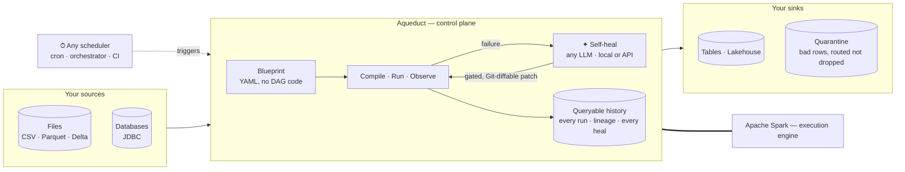

```mermaid
flowchart LR
    SCHED["⏱ Any scheduler<br/>cron · orchestrator · CI"] -. triggers .-> CP

    subgraph SRC["Your sources"]
        direction TB
        S1[("Files<br/>CSV · Parquet · Delta")]
        S2[("Databases<br/>JDBC")]
    end

    subgraph CP["Aqueduct — control plane"]
        direction LR
        BP["Blueprint<br/>YAML, no DAG code"] --> RUN["Compile · Run · Observe"]
        RUN -- failure --> HEAL["✦ Self-heal<br/>any LLM · local or API"]
        HEAL -- "gated, Git-diffable patch" --> RUN
        RUN --> OBS[("Queryable history<br/>every run · lineage · every heal")]
    end

    SRC --> CP
    CP --> SNK

    subgraph SNK["Your sinks"]
        direction TB
        T1[("Tables · Lakehouse")]
        T2[("Quarantine<br/>bad rows, routed not dropped")]
    end

    CP === SPARK["Apache Spark — execution engine"]
```
