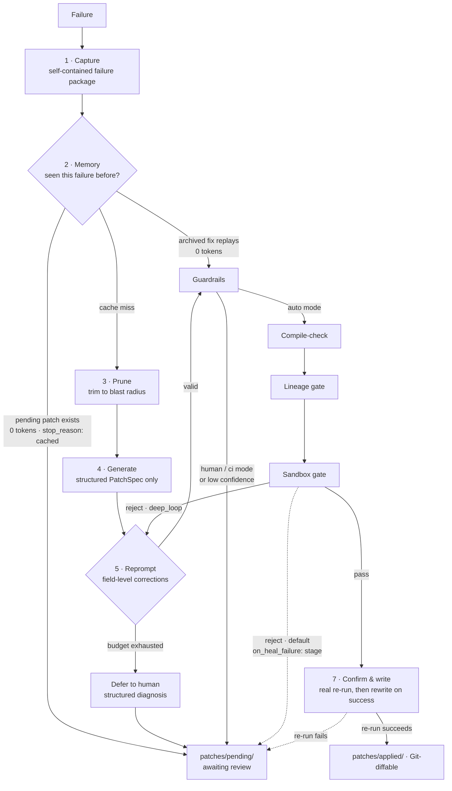

```mermaid
flowchart TD
    F[Failure] --> CAP[1 · Capture<br/>self-contained failure package]
    CAP --> MEM{2 · Memory<br/>seen this failure before?}
    MEM -- pending patch exists<br/>0 tokens · stop_reason: cached --> PENDING
    MEM -- archived fix replays<br/>0 tokens --> G1
    MEM -- cache miss --> PR[3 · Prune<br/>trim to blast radius]
    PR --> GEN[4 · Generate<br/>structured PatchSpec only]
    GEN --> RE{5 · Reprompt<br/>field-level corrections}
    RE -- valid --> G1[Guardrails]
    RE -- budget exhausted --> HUM[Defer to human<br/>structured diagnosis]
    HUM --> PENDING
    G1 -- human / ci mode<br/>or low confidence --> PENDING[patches/pending/<br/>awaiting review]
    G1 -- auto mode --> G2[Compile-check]
    G2 --> G3[Lineage gate]
    G3 --> G4[Sandbox gate]
    G4 -- reject · deep_loop --> RE
    G4 -. reject · default<br/>on_heal_failure: stage .-> PENDING
    G4 -- pass --> CW[7 · Confirm & write<br/>real re-run, then rewrite on success]
    CW -- re-run succeeds --> APPLIED[patches/applied/ · Git-diffable]
    CW -. re-run fails .-> PENDING
```
