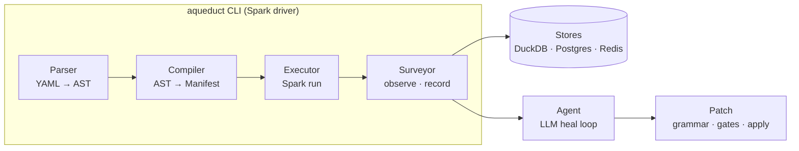

```mermaid
flowchart LR
    subgraph CLI["aqueduct CLI (Spark driver)"]
        P[Parser<br/>YAML → AST] --> C[Compiler<br/>AST → Manifest]
        C --> E[Executor<br/>Spark run]
        E --> S[Surveyor<br/>observe · record]
    end
    S --> ST[(Stores<br/>DuckDB · Postgres · Redis)]
    S --> AG[Agent<br/>LLM heal loop]
    AG --> PT[Patch<br/>grammar · gates · apply]
```
