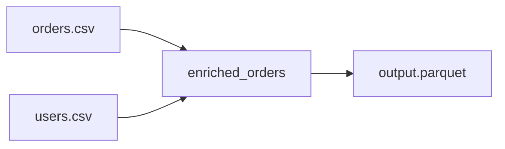

# Join Variants Snippet

Demonstrates how to perform relational joins between multiple data sources in an Aqueduct pipeline.

## Setup

```bash
pip install -r requirements.txt
```

## Key Concept: Multiple Ingress Sources
This snippet shows a multi-input DAG (Directed Acyclic Graph) where two independent CSV sources are fed into a single processing channel.

## Join Types
While this example uses a **LEFT JOIN**, Spark SQL supports all standard variants:
- **INNER JOIN**: Only records with matching keys in both tables.
- **LEFT JOIN**: All records from the left table, with matches from the right.
- **ANTI JOIN**: Only records from the left table that have **no** match in the right.
- **SEMI JOIN**: Only records from the left table that **do** have a match in the right (but without columns from the right).

## How to Run

1. **Generate test data**:
   ```bash
   python populate_data.py
   ```

2. **Execute the Pipeline**:
   ```bash
   aqueduct run blueprint.yml
   ```

3. **Inspect Results**:
   ```bash
   python inspect_results.py
   ```

## DAG Visualization

