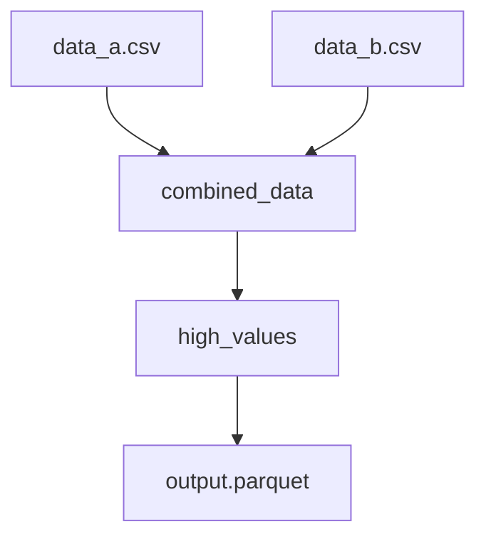

# Union & Fan-out Snippet

Demonstrates how to merge multiple data streams into one and then split or filter them into separate downstream paths.

## Key Concepts

### 1. Union (Merging)
The `union` operation combines records from multiple upstream modules. 
- **Automatic Schema Resolution**: Aqueduct can handle missing columns if `allow_missing_columns: true` is set.
- **Deduplication**: By default, `union` in Spark SQL behaves like `UNION ALL` (preserving duplicates).

### 2. Fan-out (Splitting)
A single module (like `combined_data`) can serve as the input for multiple downstream channels. This allows you to split a single data stream into parallel processing paths (e.g., one path for "High Values", another for "Audit Logs").

## How to Run

1. **Execute the Pipeline**:
   ```bash
   aqueduct run blueprint.yml
   ```

2. **Inspect Results**:
   ```bash
   python inspect_results.py
   ```

## DAG Visualization

