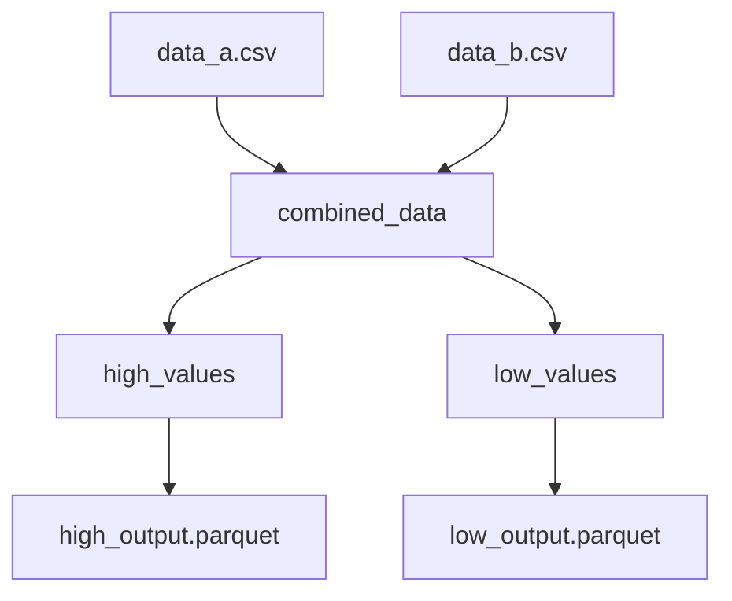

# Union & Fan-out Snippet

Demonstrates how to merge multiple data streams into one and then send the
combined stream to two independent downstream consumers.

## Key Concepts

### 1. Union (Merging)
The `union` operation combines records from multiple upstream modules.
- **Automatic Schema Resolution**: Aqueduct can handle missing columns if
  `allow_missing_columns: true` is set.
- Default Spark SQL behaviour is `UNION ALL` (preserves duplicates).

### 2. Fan-out (Splitting)
A single module like `combined_data` can serve as input for **multiple**
downstream modules — this is a fan-out. In this blueprint `combined_data` goes
to both `high_values` (filtered) and `low_values` (filtered) simultaneously.
Fan-out is zero-cost: Spark evaluates the upstream only once.

## How to Run

```bash
aqueduct run blueprint.yml
python inspect_results.py
```

## DAG Visualization

