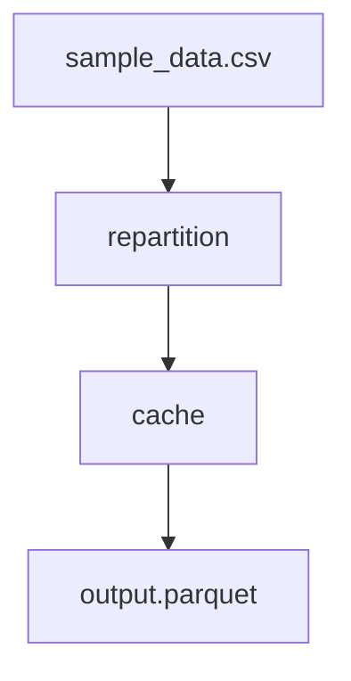

# Repartition & Cache Snippet

Demonstrates how to optimize Spark execution by controlling data distribution and persistence.

## Key Operations

### 1. Repartition
The `repartition` operation redistributes data across a specified number of partitions (`num_partitions: 10`).
- **Use Case**: Increasing parallelism for large datasets or balancing skewed partitions.
- **Note**: This triggers a **Shuffle**, which is an expensive network operation, so it should be used strategically.

### 2. Cache
The `cache` operation persists a DataFrame in memory (and disk if memory is full).
- **Use Case**: When the same module is used by multiple downstream branches (Fan-out).
- **Benefit**: Prevents Spark from re-computing the entire upstream lineage multiple times.
- **Default**: Aqueduct uses `MEMORY_AND_DISK` storage level by default.

## How to Run

1. **Execute the Pipeline**:
   ```bash
   aqueduct run blueprint.yml
   ```

2. **Inspect Results**:
   ```bash
   python inspect_results.py
   ```

## DAG Visualization

