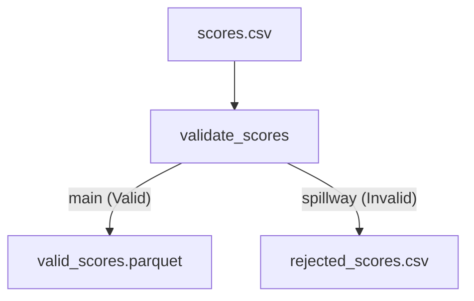

# Spillway & Passive Regulator Snippet

Demonstrates the **Passive Regulator** pattern: a powerful way to handle data validation and error routing without breaking the pipeline flow.

## The Spillway Pattern

In Aqueduct, a `Channel` can have multiple output ports. By default, data flows through the **Main** port. However, you can configure a **Spillway** to catch "bad" or "outlier" data.

### How it works in this snippet:
1. **Validation**: The `validate_scores` module checks if a score is between 0 and 100.
2. **Main Path**: Valid records stay in the main stream and flow to `valid_scores.parquet`.
3. **Spillway Path**: Records that are NULL or out of range are routed through the `spillway` port to `rejected_scores.csv` for manual auditing.

## Why use this?
- **Data Quality**: Automatically isolate bad data instead of letting it pollute your downstream analytics.
- **Observability**: Easily see exactly which records failed validation and why.
- **Robustness**: Prevents the entire pipeline from failing just because a few rows are malformed.

## How to Run

1. **Execute the Pipeline**:
   ```bash
   aqueduct run blueprint.yml
   ```

2. **Inspect Results**:
   ```bash
   python inspect_results.py
   ```

## DAG Visualization

