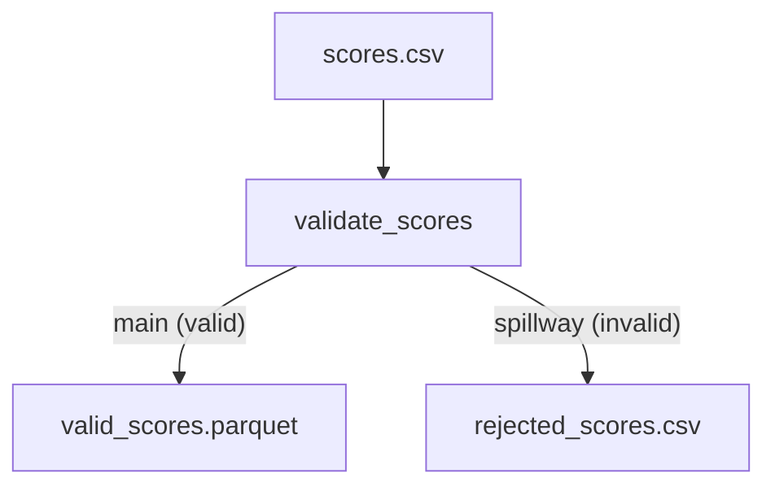

# Spillway Channel Snippet

Demonstrates the **Spillway** pattern: a Channel that routes invalid records
to a separate output without breaking the pipeline.

## What's a Spillway?

A `Channel` can have a `spillway_condition` — a SQL expression that identifies
problematic rows. Those rows are silently diverted to the `spillway` port while
clean rows continue through the `main` port. This is **not** a Regulator module
(it does not gate the pipeline); it is a row-level routing filter built into the
Channel itself.

### Blueprint walkthrough

1. `validate_scores` is a `Channel` with `spillway_condition`:
   ```sql
   try_cast(score AS DOUBLE) IS NULL OR try_cast(score AS DOUBLE) < 0 ...
   ```
2. Records that pass → `main` port → `valid_scores.parquet`
3. Records that fail → `spillway` port → `rejected_scores.csv`

The `try_*` family of functions catches malformed values (like `"abc"`)
without aborting the Spark stage — contrasted with a bare `CAST(...)`
that throws under ANSI mode.

## How to Run

```bash
aqueduct run blueprint.yml
python inspect_results.py
```

> **Typed spillway (`error_types`):** See
> [`40_error_types_quality`](../40_error_types_quality) for a full demo
> of typed spillway edges with Assert quarantine rules.

## DAG Visualization

